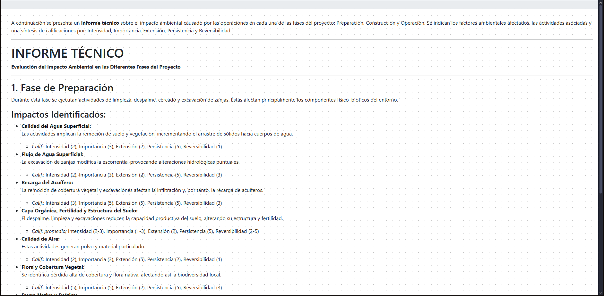

# HuellaVial

#### Purpose
Academic project for Emprendimiento (Entrepreneurship), developed to automate an Impact Matrix tool used by biologists.

#### Description
This software digitizes and automates the Impact Matrix, a methodology traditionally used to:

* Summarize and evaluate environmental data for construction projects.
* Detect potential damages to natural resources (e.g., water, soil, biodiversity).
* Streamline reporting for compliance and decision-making.

## Dashboard
The dashboard displays all the projects created by the user. From here, users can either select an existing project or create a new one.

The following image illustrates how to create a new project:

## Imact Matrix
This is the core tool where users input and manage project data. The matrix allows users to:

- Mark cells where a specific operation (column) impacts a particular resource (row).
- Edit the description column to briefly explain the nature of the impact.
- Adjust the weights based on different criteria—users can assign values from 1 to 5 in the last columns.

## Report
The system generates a report using a Large Language Model (ChatGPT) through Microsoft Azure cloud services.

